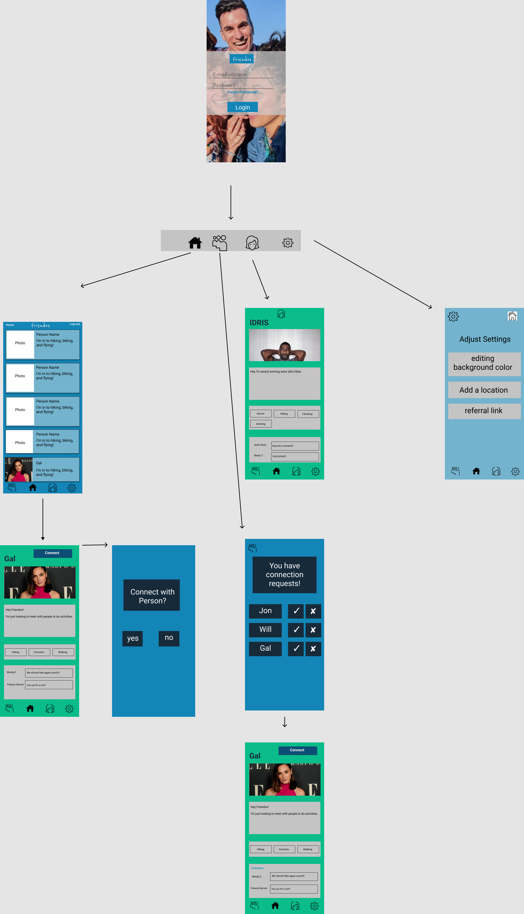

Unit 8: Group Milestone - README
===

# FRIENDOS

## Table of Contents
1. [Overview](#Overview)
1. [Product Spec](#Product-Spec)
1. [Wireframes](#Wireframes)
2. [Schema](#Schema)

## Overview
### Description
Creates a profile for a user based on hobbies they enjoy, and connects them with individuals with similar hobbies. Can be used for making new friends who enjoy similar activities.

### App Evaluation
- **Category:** Social Networking / Hobbies
- **Mobile:** This app would be primarily developed for mobile devices.
- **Story:** Analyzes users' hobbies, and connects them to other users with similar choices.
- **Market:** Any individual 17+ could choose to use this app.
- **Habit:** This app could be used as often or unoften as the user wanted depending on how deep their social life is, and what exactly they're looking for.
- **Scope:** First we'll start with connecting people based on their interests, and then as we expand we can allow them to message each other within the app and increase customization options.

## Product Spec
### 1. User Stories (Required and Optional)

**Required Must-have Stories**
### Tier 1

* User signs up for app
* User logs into app

User story demonstration for log in and sign up:


* User can edit profile screen, including adding interest and a bio
* User can view their own bio
* User can see a list of people using the app
* User can view an individual person's profile, including bio and interests
* User can add comments to a person's profile

### Tier 2

* User can add new interests to their list
* User can add a location to their profile
* User can connect with another individual
* User can edit the background color of their profile
* User can send a referral link to others to invite them to join Friendos

**Optional Nice-to-have Stories**
### Tier 3

* User can create and use a group chat based on Facebook Messenger API
* User can add a story that links keywords
* User can further customize their individual profile
* User logs into app via Facebook API authentication

### 2. Screen Archetypes

* Login 
   * User can register and login via Facebook.
* Home Screen
   * Shows other users that match with the user.
* Profile Screen 
   * Allows user to upload a photo, create a bio, and share their interests with others.
* Settings Screen
   * Lets the user change their settings.
* People Profile Screen
   * Shows detailed profiles of other users.
* Connection Request Screen
   * Allows user to request to connect with other users.
* My Requests Screen
   * Allows user to accept or reject requests from other users.

### 3. Navigation

**Tab Navigation** (Tab to Screen)

* Profile
* My Requests
* Settings

**Flow Navigation** (Screen to Screen)
* Forced Log-in -> Account creation if no log in is available.
* Create Profile or Jumps to Home Page, if user already has an account.
* Profile -> Settings.
* Settings -> Toggle settings.
* Home Page -> Other Profiles.
* Other Profiles -> Connection Request.
* Home Page -> My Requests.

## Wireframes
<br>
<br>

## Schema

### Models
<br>

### Networking
#### Login Screen
* (Read / GET) - Login
```swift
// (Read / GET) - Login user
@IBAction func signin(_ sender: Any) {
    PFUser.logInWithUsername(inBackground: self.txtUsernameSignin.text!, password: self.txtPasswordSignin.text!) {
      (user: PFUser?, error: Error?) -> Void in
      if user != nil {
        self.displayAlert(withTitle: "Login Successful", message: "")
      } else {
        self.displayAlert(withTitle: "Error", message: error!.localizedDescription)
      }
    }
}
```
* (Read / GET) - Check if user already logged in
```swift
// (Read / GET) - Get current logged in user
if PFUser.current() != nil {
  // Add code to redirect to Home screen if already logged in 
}

```
* (Read / GET) - Get current logged in user’s background color
```swift
// (Read / GET) - Get current logged in user’s background color
let curUser = PFUser.current()
let backgroundColor = curUser["background_color"]
```
* (Create / POST) - Create new login credentials
```swift
// (Create / POST) - Create new login credentials
@IBAction func signup(_ sender: Any) {
    let user = PFUser()
    user.username = self.txtUsernameSignup.text
    user.password = self.txtPasswordSignup.text

    self.indicatorSignup.startAnimating()
    user.signUpInBackground {(succeeded: Bool, error: Error?) -> Void in
        self.indicatorSignup.stopAnimating()
        if let error = error {
            self.displayAlert(withTitle: "Error", message: error.localizedDescription)
        } else {
            self.displayAlert(withTitle: "Success", message: "Account has been successfully created")
        }
    }
}
```

#### Home Screen
* (Read / Get) - Get users name, bio, and photo with matching interests
```swift
// (Read / GET) - Find the current user's interests to use in query
let userInterestQuery = PFQuery(className:"UserInterests")
userInterestQuery.whereKey("user_id", equalTo: PFUser.current())
let userInterestsResults = userInterestQuery.findObjects()
let userInterests = userInterestResults["interest_id"]

// (Read / Get) - Get users name, bio, and photo with matching interests
let matchQuery = PFQuery(className: "UserInterests")
matchQuery.containedIn("interest_id", userInterests)
let matchResults = matchQuery.findObjects()
let matchUsers = matchResults["user_id"]
```

#### Profile Screen
* (Read / GET) - Get logged in users photo, bio, interests
```swift
let user = PFUser.current()
// Get user bio and photo
let bio = user?["bio"]
let photo = user?["image"]

// Find interests
let query = PFQuery(className: "UserInterests")
query.includeKey("interest_id")
query.whereKey("user_id", equalTo: user)

// String to hold interests
var interests = [String]()

// Loop through results and put interests into the array
// This happens in the background, so need call reload view when complete
query.findObjectsInBackground(block: { (objects, error) in
    if (error == nil) {
        if let interest_list = objects{
            for interest in interest_list {
                let cur_interest = interest["interest_id"] as! PFObject
                interests.append(cur_interest["interest"] as! String)
            }

            print(interests)
        }

    } else {
        print("Error")
    }
})
```
* (Read / GET) - Get comments on logged in user’s photo
```swift
// (Read / GET) - Get comments on logged in user’s photo
let query = PFQuery(className:"Post")
```
* (Update / PUT) - Update user bio
```swift
// (Update / PUT) - Update user bio
let query = PFQuery(className:"Post")
```
* (Update / PUT) - Update user interests
```swift
// (Update / PUT) - Update user interests
let query = PFQuery(className:"Post")
```
* (Update / PUT) - Update user photo
```swift
// (Update / PUT) - Update user photo
let query = PFQuery(className:"Post")
```

#### Settings Screen
* (Read / GET) - Get user background color, location, referral link
```swift
// (Read / GET) - Get user background color, location, referral link
let query = PFQuery(className:"Post")
```
* (Update / PUT) - Change background color
```swift
// (Update / PUT) - Change background color
let query = PFQuery(className:"Post")
```
* (Update / PUT) - Change location
```swift
// (Update / PUT) - Change location
let query = PFQuery(className:"Post")
```
 
#### People Profile Screen
* (Read / GET) - Get user’s bio, interests, photo, comments
```swift
let user = PFUser("user_ID")
// Get user bio and photo
let bio = user?["bio"]
let photo = user?["image"]

// Find interests
let query = PFQuery(className: "UserInterests")
query.includeKey("interest_id")
query.whereKey("user_id", equalTo: user)

// String to hold interests
var interests = [String]()

// Loop through results and put interests into the array
// This happens in the background, so need call reload view when complete
query.findObjectsInBackground(block: { (objects, error) in
    if (error == nil) {
        if let interest_list = objects{
            for interest in interest_list {
                let cur_interest = interest["interest_id"] as! PFObject
                interests.append(cur_interest["interest"] as! String)
            }

            print(interests)
        }

    } else {
        print("Error")
    }
})
```
* (Update / PUT) - Add a new comment
```swift
// (Update / PUT) - Add a new comment
let query = PFQuery(className:"Post")
```
 
#### Connection Request Screen
* (Update / PUT) - Create a friend request with the person
```swift
// (Update / PUT) - Create a friend request with the person
let query = PFQuery(className:"Post")
```
#### My Requests Screen
* (Read / GET) - Get connection requests that have not been accepted / rejected
```swift
// (Read / GET) - Get connection requests that have not been accepted / rejected
let query = PFQuery(className:"Post")
```
* (Update / PUT) - Set connection request to accepted / rejected
```swift
// (Update / PUT) - Set connection request to accepted / rejected
let query = PFQuery(className:"Post")
```


